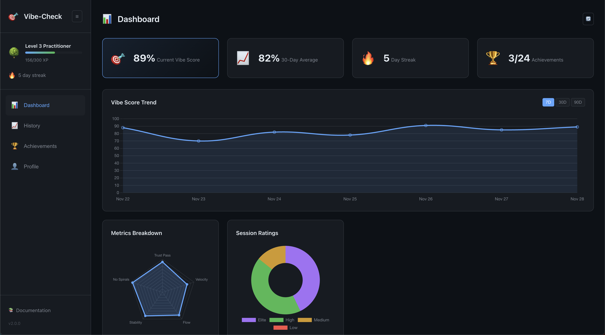

# vibe-check



[](https://www.npmjs.com/package/@boshu2/vibe-check)
[](https://github.com/boshu2/vibe-check/actions/workflows/ci.yml)
[](https://opensource.org/licenses/MIT)

**Git-powered metrics for AI-assisted coding.** Catch debug spirals before they catch you.

```bash
npx @boshu2/vibe-check --since "2 hours ago"
```

```
╭──────────────────────────────────────────────────────────────╮
│  VIBE-CHECK                                    Nov 30, 2025  │
├──────────────────────────────────────────────────────────────┤
│                                                              │
│  Rating: ELITE ✨                                            │
│                                                              │
│  Trust Pass Rate   ████████████████████  95%  ELITE          │
│  Rework Ratio      ████░░░░░░░░░░░░░░░░  18%  ELITE          │
│  Debug Spirals     None detected              ELITE          │
│                                                              │
│  You're in the zone. Ship it.                                │
│                                                              │
╰──────────────────────────────────────────────────────────────╯
```

---

## Dashboard

```bash
vibe-check dashboard
```

Opens the dashboard above in your browser. Features:
- 📊 Score trend charts with 7/30/90 day views
- 🎯 AI-generated insights about your coding patterns
- 🏆 Achievement tracking (19 achievements, 2 hidden)
- 📈 Session history and ratings distribution
- 🌙 GitHub dark theme

---

## Install

```bash
npm install -g @boshu2/vibe-check
```

## Quick Start

```bash
# Analyze recent work
vibe-check --since "1 week ago"

# Real-time spiral detection
vibe-check watch

# Visual dashboard
vibe-check dashboard

# View your profile & achievements
vibe-check profile
```

---

## Watch Mode

Catch spirals **as they happen**, not after:

```bash
vibe-check watch
```

```
VIBE-CHECK WATCH MODE
Monitoring: ~/projects/my-app
────────────────────────────────────────────────────────

  09:15  fix(auth): handle token refresh
  09:18  fix(auth): add retry logic
  09:22  fix(auth): increase timeout

  ⚠️  SPIRAL DETECTED
  ┌────────────────────────────────────────────────────┐
  │  Component: auth                                   │
  │  Fixes: 3 commits over 7 minutes                   │
  │                                                    │
  │  💡 Consider:                                      │
  │     • Step back and write a test                   │
  │     • Check the docs or ask for help               │
  │     • Take a 5-minute break                        │
  └────────────────────────────────────────────────────┘

────────────────────────────────────────────────────────
```

---

## Gamification

Level up your coding with XP, streaks, and achievements:

```bash
vibe-check profile
```

```
╭─────────────────────────────────────────────────────╮
│                                                     │
│   🏔️  Level 6 Grandmaster                          │
│   ████████████████░░░░░░░░  2140 / 5000 XP         │
│                                                     │
│   🔥  12 day streak (longest: 14)                   │
│   🏆  8/19 achievements unlocked                    │
│                                                     │
│   Recent Unlocks:                                   │
│   ✨ Elite Vibes    🧘 Zen Master    📊 Regular     │
│                                                     │
╰─────────────────────────────────────────────────────╯
```

**19 achievements** including 2 hidden ones. Can you find them?

---

## The Metrics

| Metric | What It Measures | 🟢 Elite | 🔴 Needs Work |
|--------|------------------|----------|---------------|
| **Trust Pass Rate** | % commits without immediate fix | >95% | <80% |
| **Rework Ratio** | % commits that are fixes | <30% | >50% |
| **Debug Spiral** | Stuck in fix loops? | 0 | 3+ |

---

## Vibe Levels

Declare your trust level before starting work:

```bash
vibe-check start --level 3
# ... code ...
vibe-check --since "1 hour ago"
```

| Level | Name | Trust | Use For |
|-------|------|-------|---------|
| **5** | Full Auto | 95% | Formatting, linting |
| **4** | High Trust | 80% | Boilerplate, CRUD |
| **3** | Balanced | 60% | Features, tests |
| **2** | Careful | 40% | Integrations, APIs |
| **1** | Skeptical | 20% | Architecture, security |
| **0** | Manual | 0% | Novel research |

---

## Git Hook

Auto-run before every push:

```bash
vibe-check init-hook           # Install hook
vibe-check init-hook --block-low  # Block LOW pushes
```

---

## GitHub Action

```yaml
name: Vibe Check
on: [pull_request]

jobs:
  vibe:
    runs-on: ubuntu-latest
    steps:
      - uses: actions/checkout@v4
        with:
          fetch-depth: 0
      - uses: boshu2/vibe-check@v1
        with:
          github-token: ${{ secrets.GITHUB_TOKEN }}
```

---

## All Commands

```
vibe-check [options]           Analyze git history
vibe-check watch               Real-time spiral detection
vibe-check dashboard           Visual dashboard + insights
vibe-check profile             XP, streaks, achievements
vibe-check timeline            Coding journey visualization
vibe-check start --level <n>   Declare vibe level (0-5)
vibe-check intervene           Record spiral intervention
vibe-check init-hook           Install git hook
vibe-check cache               Manage local storage
```

**Options:**
```
--since <date>       Start date ("1 week ago", "2024-01-01")
--until <date>       End date (default: now)
--score              Include VibeScore calculation
--simple             Compact output
--format <type>      terminal | json | markdown
--output <file>      Save JSON to file
--verbose            Detailed output
```

---

## Philosophy

**vibe-check is a mirror, not a judge.**

Use it for self-reflection. Catch your own patterns. Improve your own flow.

It's not a productivity metric. It's not for performance reviews. It's not measuring AI effectiveness.

It's just asking: *are you building, or are you spiraling?*

---

## Requirements

- Node.js >= 20.0.0
- Git repository with commits

## Docs

- [Vibe-Coding Ecosystem](docs/VIBE-ECOSYSTEM.md) - Full methodology
- [Architecture](docs/ARCHITECTURE.md) - Codebase structure
- [Gamification](docs/GAMIFICATION.md) - XP & achievements deep dive
- [Metrics Explained](docs/METRICS-EXPLAINED.md) - How it works
- [Changelog](CHANGELOG.md) - Version history

## License

MIT

---

<p align="center">
  <i>Built for developers who vibe with AI</i>
</p>
